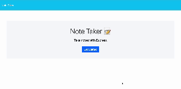

 
<h1 align="center">Note Taker </h1>

  
  
  

 

  
  
  
  
  

## Description 📚

- What was your motivation? Why did you build this project? What problem does it solve? What did you learn?

This project has been built to record notes with descriptions into a json database. These notes will then display in a list style with the option to delete the note when the task is finished. 

This was created using HTML,CSS,Markdown,Javascript,JQuery,NodeJS. Insomnia and Postman were used to check the GET/POST/DELETE callbacks. Heroku has been utilized for live deployment.

## Table of Contents 

- [User-Story](#user-story)
- [Acceptance-Criteria](#acceptance-criteria)
- [Installation](#installation-📋)
- [Usage](#usage-🏁)
- [Demonstration](#demonstration)
- [Author](#author-👋🏽)

## User Story

AS A small business owner
I WANT to be able to write and save notes
SO THAT I can organize my thoughts and keep track of tasks I need to complete

## Acceptance Criteria

GIVEN a note-taking application:
- WHEN I open the Note Taker THEN I am presented with a landing page with a link to a notes page
- WHEN I click on the link to the notes page THEN I am presented with a page with existing notes listed in the left-hand column, plus empty fields to enter a new note title and the note’s text in the right-hand column
- WHEN I enter a new note title and the note’s text THEN a "Save Note" button and a "Clear Form" button appear in the navigation at the top of the page
- WHEN I click on the Save button THEN the new note I have entered is saved and appears in the left-hand column with the other existing notes and the buttons in the navigation disappear
- WHEN I click on an existing note in the list in the left-hand column THEN that note appears in the right-hand column and a "New Note" button appears in the navigation
- WHEN I click on the "New Note" button in the navigation at the top of the page THEN I am presented with empty fields to enter a new note title and the note’s text in the right-hand column and the button disappears

## Installation 📋

- What are the steps required to install your project? Provide a step-by-step description of how to get the development environment running.

This project can be cloned using git commands in the integrated terminal
`git clone https://github.com/schneidsmc/note-taker09.git`

This project can be installed by typing `npm init` and `npm install` into the integrated terminal.

In the integrated terminal, a user can type `npm start` to initiate the port to listen on 3000. 

## Usage 🏁

Provide instructions and examples for use.

Open the project in the live server and interact with the save, clear and delete buttons. The buttons are used to correctly display or remove the input from the user which is stored in a database. 

The deployed site on heroku is at the below link.

[https://fast-anchorage-41497-26435ed16db6.herokuapp.com/](https://fast-anchorage-41497-26435ed16db6.herokuapp.com/)

## Demonstration

## Author 👋🏽

GitHub Username: [schneidsmc](https://github.com/schneidsmc)

📧 Email: schneidsmc@gmail.com

This README was created with ❤️ using README Generator 👏🏽👏🏽

